# Disentangled VAE

Replicating DeepMind's paper "Early Visual Concept Learning with Unsupervised Deep Learning"
https://arxiv.org/pdf/1606.05579.pdf

## 2D shape disentaglement

Result by changing latent Z from -3.0 to 3.0 with β=4.0

Disentaglment is obscure but latent variables with small variance "Z2", "Z3, "Z5", "Z7", "Z8" seem extracting "x", "y", "rotation" and "scale" parameters.

Other latent variables are all drawin into N(0,I), so variances are round 1.0.

(This experiment is using DeepMind's [dsprite data set](https://github.com/deepmind/dsprites-dataset).)

z0:

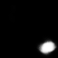

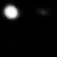
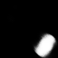
1.00

z1:
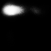

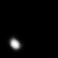
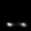
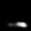
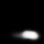

1.00

**z2**:

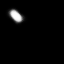

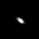

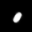
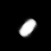
**0.02** -> rotation

**z3**:

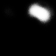

**0.05** -> rotation

z4:

1.00

**z5**:

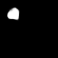

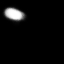
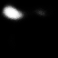

**0.03** -> X

z6:
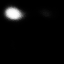

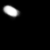

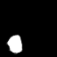
1.00

**z7**:

**0.01** -> scale

**z8**:

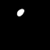

**0.02** -> Y

z9:

0.99

## Reconstruction result

Left: original Right: reconstructed image

