# Disentangled VAE

Replicating DeepMind's papers ["β-VAE: Learning Basic Visual Concepts with a Constrained Variational Framework"](https://openreview.net/forum?id=Sy2fzU9gl) and ["Understanding disentangling in β-VAE"](https://drive.google.com/file/d/0Bwy4Nlx78QCCNktVTFFMTUs4N2oxY295VU9qV25MWTBQS2Uw/view)

## 2D shape disentaglement

Result by changing latent Z from -3.0 to 3.0 with γ=100.0 and C=20.0

Latent variables with small variances seem extracting "x", "y", "rotation" and "scale" parameters.

(This experiment is using DeepMind's [dsprite data set](https://github.com/deepmind/dsprites-dataset).)

Z  | Image                             | Parameter | Variance
---| ----------------------------------|---------- |-------
z0 | 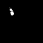 |           | 0.9216
z1 |  |           | 0.9216
z2 | 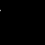 | Rotation  | 0.0011
z3 |  | Rotation? | 0.0038
z4 |  | Pos X     | 0.0002
z5 | 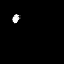 |           | 0.9384
z6 |  | Scale?    | 0.0004
z7 |  |           | 0.8991
z8 |  |           | 0.9483
z9 |  | Pos Y     | 0.0004

## Reconstruction result

Left: original Right: reconstructed image

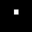

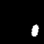
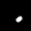

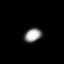

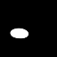

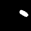
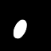

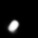

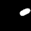

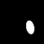
